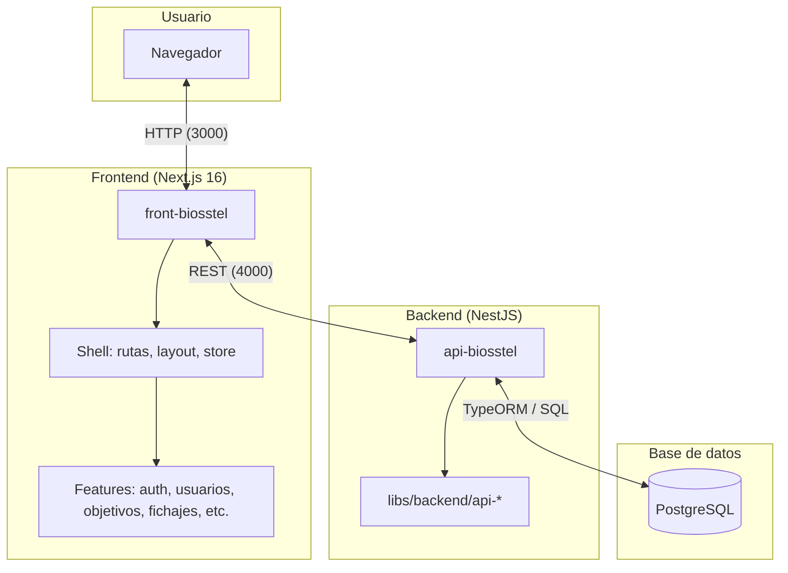
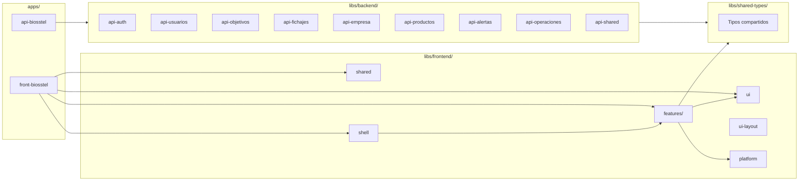
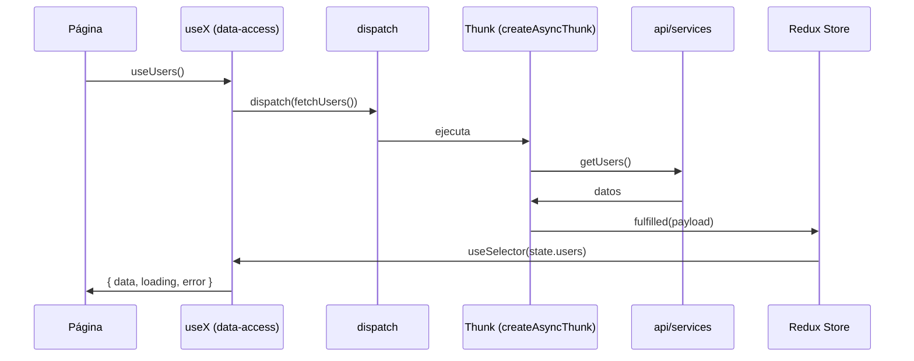
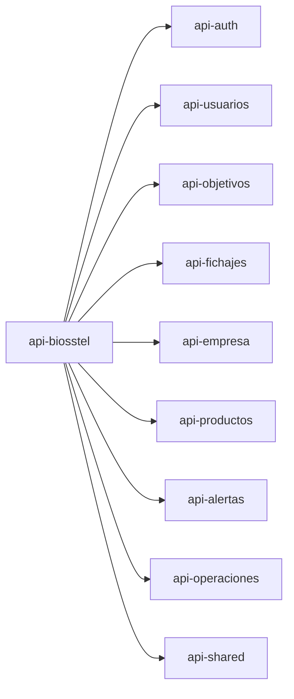
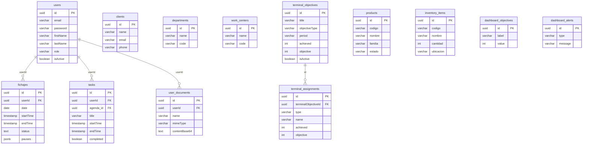
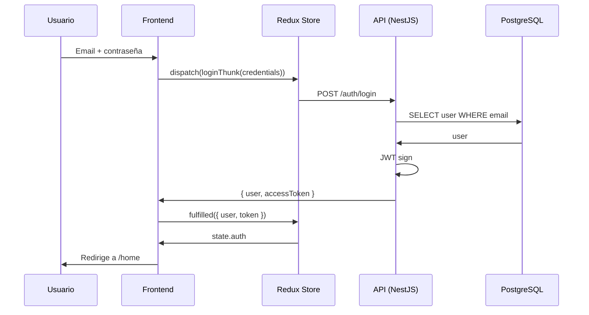
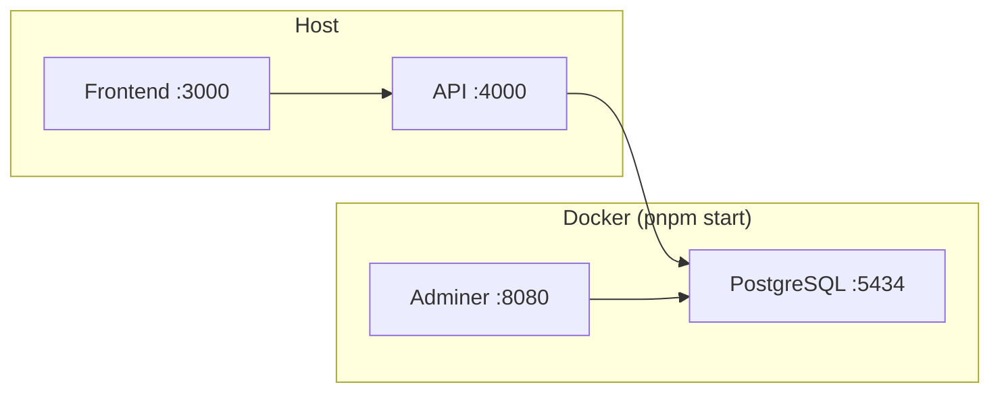

# Diagramas de arquitectura – Biosstel

Documentación visual de la arquitectura del monorepo: sistema, frontend, backend y base de datos.

---

## 1. Vista general del sistema



---

## 2. Estructura del monorepo



---

## 3. Arquitectura del Frontend

```mermaid
flowchart TB
    subgraph App["front-biosstel (Next.js App Router)"]
        Router["[locale]/[[...path]]"]
        Providers[Providers: Redux, AuthRestore]
        Router --> Providers
    end

    subgraph Shell["@biosstel/shell"]
        Store[Store global]
        CatchAll[CatchAllPage]
        RouteRegistry[routeRegistry]
        Store --> CatchAll
        RouteRegistry --> CatchAll
    end

    subgraph Features["Features (@biosstel/*)"]
        Auth[auth]
        Usuarios[usuarios]
        Objetivos[objetivos]
        Fichajes[fichajes]
        Empresa[empresa]
        Alertas[alertas]
        Productos[productos]
        Inventory[inventory]
        Reports[reports]
        Operaciones[operaciones]
    end

    subgraph DataAccess["Data-access por feature"]
        Slices[Redux slices]
        Thunks[Thunks → API]
        Hooks[Hooks: useX]
        Slices --> Thunks
        Hooks --> Slices
    end

    subgraph UI["Capas UI"]
        UiLib[@biosstel/ui]
        UiLayout[@biosstel/ui-layout]
        Platform[@biosstel/platform]
    end

    Providers --> Store
    CatchAll --> Features
    Features --> DataAccess
    DataAccess --> UiLib
    DataAccess --> UiLayout
    Thunks -->|"fetch"| API
```

### Flujo de datos en el Frontend (Redux)



---

## 4. Arquitectura del Backend (Hexagonal)

```mermaid
flowchart TB
    subgraph API["api-biosstel"]
        Main[main.ts]
        AppModule[AppModule]
        Main --> AppModule
    end

    subgraph Feature["Cada lib api-* (ej. api-usuarios)"]
        subgraph Application["application/"]
            PortsIn[Ports Input]
            PortsOut[Ports Output]
            UseCases[Use Cases]
            PortsIn --> UseCases
            UseCases --> PortsOut
        end

        subgraph Infrastructure["infrastructure/"]
            Controllers[Controllers REST]
            Repositories[Repositories TypeORM]
            Entities[Entities]
            Controllers --> PortsIn
            PortsOut --> Repositories
            Repositories --> Entities
        end
    end

    subgraph DB[(PostgreSQL)]
        Tables[(Tablas)]
    end

    AppModule --> Feature
    Entities --> Tables
```

### Módulos del Backend



---

## 5. Base de datos (PostgreSQL) – Modelo entidad-relación



---

## 6. Flujo de una petición (ejemplo: login)



---

## 7. Puertos y servicios en desarrollo



| Servicio   | Puerto | URL                       |
|-----------|--------|---------------------------|
| Frontend  | 3000   | http://localhost:3000    |
| API       | 4000   | http://localhost:4000/api |
| Swagger   | 4000   | http://localhost:4000/api/docs |
| PostgreSQL| 5434   | localhost:5434            |
| Adminer   | 8080   | http://localhost:8080     |

---

## Referencias

- [README principal](../README.md) – Inicio rápido, comandos, troubleshooting.
- [Arquitectura hexagonal](../plans/HEXAGONAL_ARCHITECTURE.md) – Backend.
- [Arquitectura frontend](../plans/arquitectura-front.md) – Features y shell.
- [Store global](../libs/frontend/shell/src/store/README.md) – Redux y composición.
