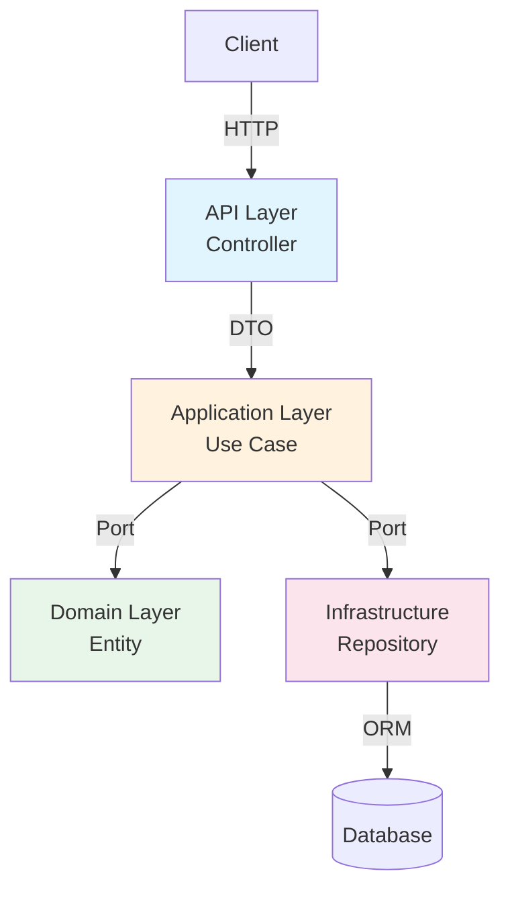

# Arquitectura API - Enterprise Modular Extractable v5

## 🌐 Visión General

Esta arquitectura aplica los principios de **Hexagonal Architecture / Ports & Adapters** y **Feature-Driven Design** al backend **NestJS**, con objetivos claros:

* **Independencia:** Cada feature es autónoma, sin dependencias cruzadas innecesarias
* **Testabilidad:** Domain y Application se pueden testear con mocks simples
* **Extraíble:** Cada feature puede ser publicada como paquete npm independiente
* **Mantenibilidad:** Código organizado por dominio (feature) y capas, no por tipo técnico

---

## 📂 Estructura de Librerías (libs)

```
libs/
├── shared-types/          # ✅ Tipos compartidos entre features
├── api-shared/            # 🔄 Utilidades transversales para todas las features
│   ├── domain/            # Value Objects globales
│   ├── application/       # Casos de uso transversales
│   └── infrastructure/    # Adaptadores comunes (DB, Cache, etc)
│
├── api-auth/              # 🔄 Feature Auth
│   ├── domain/            # Entidades y Value Objects
│   ├── application/       # Casos de uso + puertos
│   ├── infrastructure/    # Repositorios, JWT, bcrypt
│   └── api/               # Controllers / Guards / DTOs
│
├── api-users/             # 🔄 Feature Users
│   ├── domain/
│   ├── application/
│   ├── infrastructure/
│   └── api/
│
└── api-admin/             # 🔄 Feature Admin
    ├── domain/
    ├── application/
    ├── infrastructure/
    └── api/
```

---

## 🏗 Capas por Feature (Hexagonal)

### 1️⃣ Domain Layer (`domain/`)

**Propósito:** Lógica de negocio pura, sin dependencias externas

```
domain/
├── entities/
│   └── User.ts
├── value-objects/
│   ├── Email.ts
│   └── Password.ts
├── repositories/
│   └── IUserRepository.ts  # Puerto (interface)
└── events/
    └── UserCreatedEvent.ts
```

**Reglas:**

* Solo TypeScript puro
* Sin NestJS ni frameworks externos
* Portable a cualquier entorno (Node, Deno)
* Entidades con validación de invariantes

---

### 2️⃣ Application Layer (`application/`)

**Propósito:** Casos de uso y orquestación de lógica

```
application/
├── use-cases/
│   ├── CreateUser.ts
│   ├── UpdateUser.ts
│   ├── DeleteUser.ts
│   └── GetUserById.ts
├── ports/
│   ├── inbound/
│   │   └── IUserService.ts
│   └── outbound/
│       ├── IUserRepository.ts
│       └── IEventDispatcher.ts
└── dto/
    ├── CreateUserDto.ts
    └── UpdateUserDto.ts
```

**Reglas:**

* No conoce cómo se persisten datos
* Usa **puertos / interfaces** para toda comunicación externa
* Recibe y retorna tipos del domain o DTOs simples
* No depende de NestJS ni HTTP

---

### 3️⃣ Infrastructure Layer (`infrastructure/`)

**Propósito:** Implementación concreta de adaptadores

```
infrastructure/
├── persistence/
│   ├── typeorm/
│   │   ├── UserEntity.ts
│   │   └── TypeOrmUserRepository.ts
│   └── repositories/
│       └── UserRepositoryImpl.ts
├── auth/
│   ├── JwtService.ts
│   ├── BcryptService.ts
│   └── PasswordService.ts
└── cache/
    └── RedisUserCache.ts
```

**Reglas:**

* Implementa los puertos definidos en application
* Puede usar frameworks (TypeORM, Prisma, Redis)
* Swappable: se puede cambiar un adaptador sin tocar la lógica de negocio
* No contiene lógica de negocio

---

### 4️⃣ API Layer (`api/`) - NestJS Entry Point

**Propósito:** Adaptador HTTP / Controllers / DTOs

```
api/
├── controllers/
│   └── UserController.ts
├── guards/
│   └── JwtAuthGuard.ts
├── decorators/
│   └── CurrentUser.ts
├── filters/
│   └── HttpExceptionFilter.ts
└── module.ts
```

**Reglas:**

* Solo traduce HTTP → Casos de uso
* No contiene lógica de negocio
* Inyecta servicios de application layer
* Define rutas y verbos HTTP

---

## 🔄 Flujo de Petición



---

## ⚡ Beneficios

| Beneficio      | Descripción                                                    |
| -------------- | -------------------------------------------------------------- |
| Testabilidad   | Domain y Application testeables sin infraestructura            |
| Flexibilidad   | Cambiar TypeORM por Prisma o Mongo sin tocar lógica de negocio |
| Reusabilidad   | Domain usable en CLI, Workers o microservicios                 |
| Mantenibilidad | Código organizado por feature, no por tipo técnico             |
| Escalabilidad  | Cada feature es un módulo independiente y extraíble           |
| Portabilidad   | Cada feature puede convertirse en paquete npm                 |

---

## 🧪 Ejemplo: Crear Usuario

### 1️⃣ Domain Layer

```ts
export class User {
  private constructor(
    public readonly id: string,
    public readonly email: Email,
    public readonly password: Password,
    public readonly firstName: string,
    public readonly lastName: string,
    public readonly isActive: boolean
  ) {}

  static create(props: CreateUserProps): User {
    if (!props.email) throw new Error('Email is required');
    return new User(..., props);
  }

  deactivate(): void {
    this.isActive = false;
  }
}
```

### 2️⃣ Application Layer - Puerto

```ts
export interface IUserRepository {
  findById(id: string): Promise<User | null>;
  findByEmail(email: string): Promise<User | null>;
  save(user: User): Promise<User>;
  delete(id: string): Promise<void>;
}
```

### 3️⃣ Application Layer - Use Case

```ts
export class CreateUserUseCase {
  constructor(private userRepository: IUserRepository) {}

  async execute(dto: CreateUserDto): Promise<User> {
    const existing = await this.userRepository.findByEmail(dto.email);
    if (existing) throw new UserAlreadyExistsError(dto.email);

    const user = User.create({
      email: new Email(dto.email),
      password: new Password(dto.password),
      firstName: dto.firstName,
      lastName: dto.lastName,
    });

    return this.userRepository.save(user);
  }
}
```

### 4️⃣ Infrastructure Layer - Adaptador

```ts
@Injectable()
export class TypeOrmUserRepository implements IUserRepository {
  constructor(@InjectRepository(UserEntity) private repo: Repository<UserEntity>) {}

  async findById(id: string): Promise<User | null> {
    const entity = await this.repo.findOne({ where: { id } });
    return entity ? this.mapToDomain(entity) : null;
  }

  async save(user: User): Promise<User> {
    const entity = this.mapToEntity(user);
    const saved = await this.repo.save(entity);
    return this.mapToDomain(saved);
  }

  private mapToDomain(entity: UserEntity): User { /* ... */ }
  private mapToEntity(user: User): UserEntity { /* ... */ }
}
```

### 5️⃣ API Layer - Controller

```ts
@Controller('users')
export class UserController {
  constructor(private createUser: CreateUserUseCase) {}

  @Post()
  async create(@Body() dto: CreateUserDto): Promise<UserResponse> {
    const user = await this.createUser.execute(dto);
    return UserPresenter.toResponse(user);
  }
}
```

---

## 🔧 Nx Config & Boundaries

```json
// libs/api-users/project.json
{
  "name": "api-users",
  "tags": ["type:feature", "scope:api-users"],
  "implicitDependencies": ["api-shared"]
}
```

```json
// nx.json boundaries
"boundedContext": {
  "strict": true,
  "allow": {
    "api-auth": ["api-shared", "shared-types"],
    "api-users": ["api-shared", "shared-types"],
    "api-shared": ["shared-types"]
  }
}
```

---

## 🏁 Próximos Pasos

1. [ ] Crear `libs/api-shared` (utilidades comunes)
2. [ ] Refactorizar `libs/api-auth` con Hexagonal Architecture
3. [ ] Refactorizar `libs/api-users` con Hexagonal Architecture
4. [ ] Configurar Nx boundaries estrictos
5. [ ] Actualizar `apps/api-biosstel` para usar nuevos libs
6. [ ] Implementar tests unitarios y E2E
