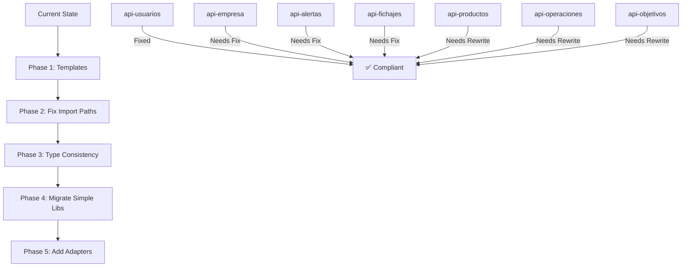

# Backend Libraries Consistency Plan

## Current Analysis

### Library Structures Identified

| Library | Has CQRS | Has Ports | Has Adapters | Has Entities | Has Use Cases |
|---------|----------|-----------|--------------|--------------|---------------|
| api-usuarios | ✅ | ✅ | ✅ | ✅ | ✅ |
| api-empresa | ✅ | ✅ | ❌ (missing) | ✅ | ✅ |
| api-alertas | ✅ | ✅ | ❌ (missing) | ✅ | ✅ |
| api-fichajes | ✅ | ✅ | ❌ (missing) | ✅ | ✅ |
| api-productos | ❌ | ❌ | ❌ | ❌ | ❌ |
| api-operaciones | ❌ | ❌ | ❌ | ❌ | ❌ |
| api-objetivos | ❌ | ❌ | ❌ | ❌ | ❌ |

---

## Proposed Standard Structure

```
src/
├── domain/
│   ├── entities/
│   │   ├── index.ts          # Export only DTOs/inputs, NOT domain models
│   │   └── [EntityName].ts   # Only if needed for internal logic
│   ├── repositories/
│   │   ├── index.ts          # Re-export all interfaces
│   │   └── [entity]/
│   │       ├── index.ts
│   │       └── I[Entity]Repository.ts  # Interface + types from @biosstel/shared-types
│   └── index.ts
├── application/
│   ├── ports/
│   │   ├── input/
│   │   │   ├── I[Entity]Management.ts
│   │   │   └── index.ts
│   │   └── index.ts
│   ├── use-cases/
│   │   ├── [entity]/
│   │   │   ├── [Entity]ManagementUseCase.ts
│   │   │   └── index.ts
│   │   └── index.ts
│   ├── cqrs/
│   │   ├── [Entity]MediatorRegistration.ts
│   │   ├── handlers/
│   │   │   ├── commands/
│   │   │   │   └── [entity]/
│   │   │   │       └── Create[Entity].command.ts
│   │   │   └── queries/
│   │   │       └── [entity]/
│   │   │           └── Get[Entity]ById.query.ts
│   │   └── index.ts
│   └── index.ts
├── infrastructure/
│   ├── mappers/
│   │   ├── [Entity]Mapper.ts
│   │   └── index.ts
│   ├── persistence/
│   │   ├── entities/
│   │   │   ├── [Entity]Entity.ts
│   │   │   └── index.ts
│   │   └── postgres/
│   │       ├── [entity]-postgres.config.ts
│   │       ├── index.ts
│   │       └── [entity]/
│   │           ├── index.ts
│   │           └── Postgres[Entity]Repository.ts
│   ├── adapters/              # Optional - for alternative implementations
│   │   ├── index.ts
│   │   ├── mongo/
│   │   └── http/
│   └── index.ts
├── [module].module.ts
└── index.ts
```

---

## Key Principles

### 1. Shared Types First
- All domain types (User, Department, etc.) should come from `@biosstel/shared-types`
- Domain entities folder should only export DTOs/Input types, NOT domain models
- Repository interfaces should import types from shared-types

### 2. Consistent Repository Exports
```typescript
// domain/repositories/users/IUserRepository.ts
import type { User, CreateUserData, UpdateUserData, PaginatedResult } from '@biosstel/shared-types';

export type { CreateUserData, UpdateUserData, PaginatedResult, User };

export interface IUserRepository {
  findAll(page?: number, pageSize?: number): Promise<PaginatedResult<User>>;
  findById(id: string): Promise<User | null>;
  create(data: CreateUserData): Promise<User>;
  update(id: string, data: UpdateUserData): Promise<User>;
  delete(id: string): Promise<void>;
}

export const USER_REPOSITORY = Symbol('IUserRepository');
```

### 3. Entity Export Pattern
```typescript
// domain/entities/index.ts
// Only export DTOs/Input types, NOT domain models
export { CreateUserInput } from './User';
```

### 4. CQRS Handler Import Paths
```typescript
// Always use the full path to the interface
import type { IUserRepository } from '../../../../domain/repositories/users/IUserRepository';
import { USER_REPOSITORY } from '../../../../domain/repositories/users/IUserRepository';
```

### 5. Infrastructure Repository Implementation
```typescript
// infrastructure/persistence/postgres/users/PostgresUserRepository.ts
import type {
  IUserRepository,
  User,
  CreateUserData,
  UpdateUserData,
  PaginatedResult,
} from '../../../../domain/repositories';
import { UserEntity } from '../../entities';
import { UserMapper } from '../../../mappers';

export class PostgresUserRepository implements IUserRepository {
  // Implementation
}
```

---

## Issues Found and Fixes Required

### api-usuarios (Recently Fixed)
- ✅ Missing User export from repositories
- ✅ Duplicate User export in domain/index.ts
- ✅ Incorrect import paths in CQRS handlers
- ✅ Type mismatch in PostgresUserRepository
- ✅ Missing TypeOrmUserRepository export

### api-empresa
- Need to verify CQRS handler import paths
- Need to check for type mismatches
- Missing adapters folder (optional)

### api-alertas
- Need to verify CQRS handler import paths
- Need to check for type mismatches

### api-fichajes
- Need to verify CQRS handler import paths
- Need to check for type mismatches

### api-productos
- Missing complete hexagonal architecture structure
- Needs CQRS, ports, use-cases implementation

### api-operaciones
- Missing complete hexagonal architecture structure
- Needs CQRS, ports, use-cases implementation

### api-objetivos
- Missing complete hexagonal architecture structure
- Needs CQRS, ports, use-cases implementation

---

## Recommended Approach

1. **Phase 1**: Create standardized templates for each library type
2. **Phase 2**: Fix import path issues in existing CQRS handlers across all libraries
3. **Phase 3**: Verify type consistency between repositories and shared-types
4. **Phase 4**: Migrate simpler libraries (productos, operaciones, objetivos) to full hexagonal architecture
5. **Phase 5**: Add optional adapters folder to libraries that need alternative implementations

---

## Mermaid: Current vs Target State


